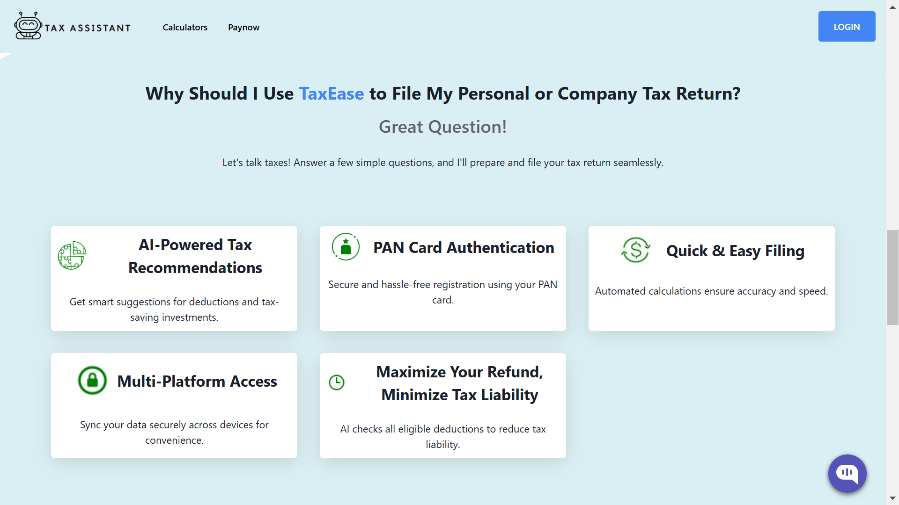
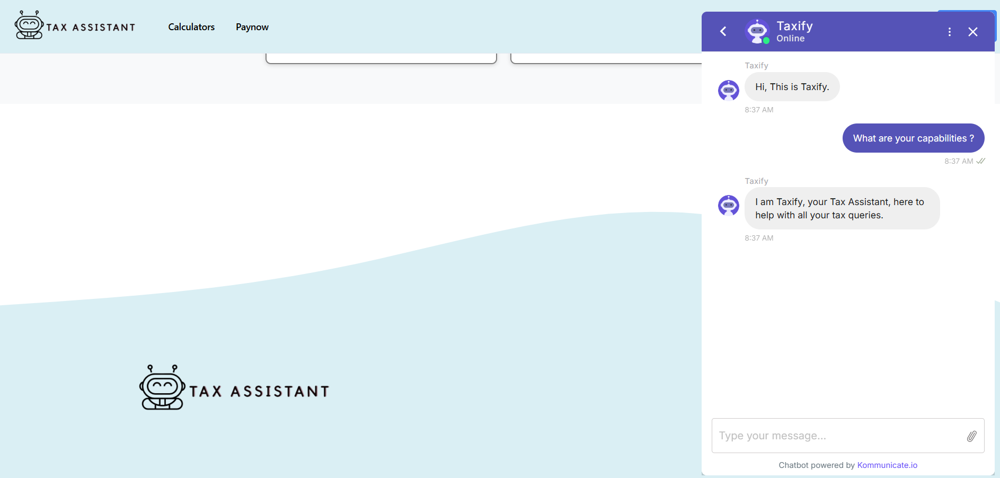
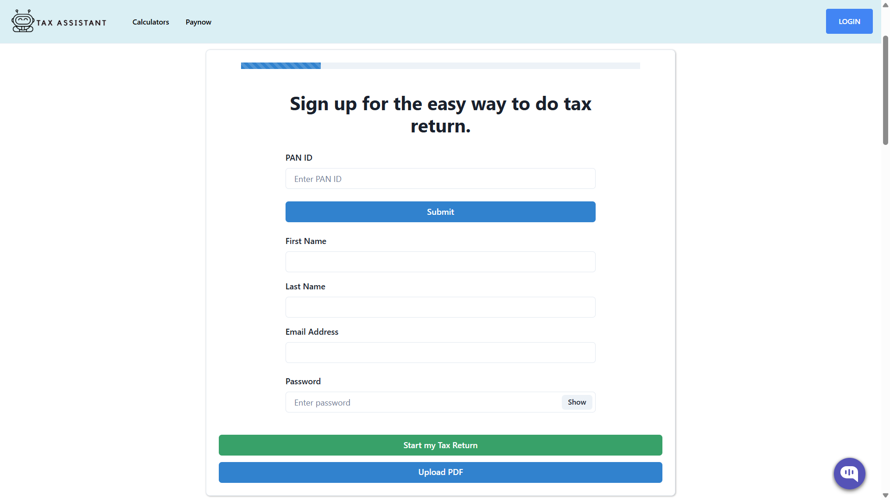
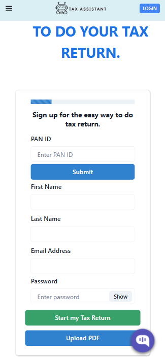
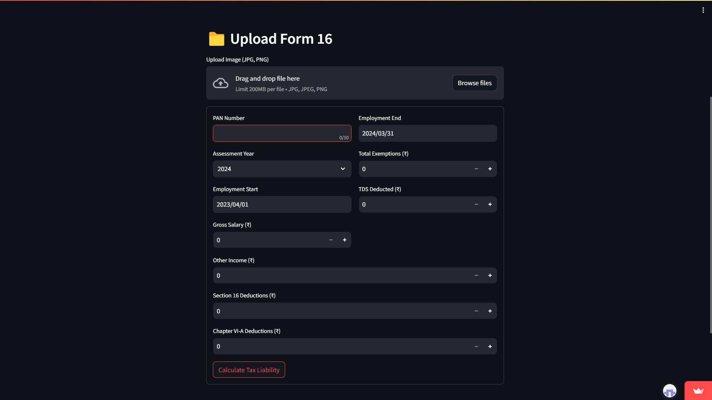
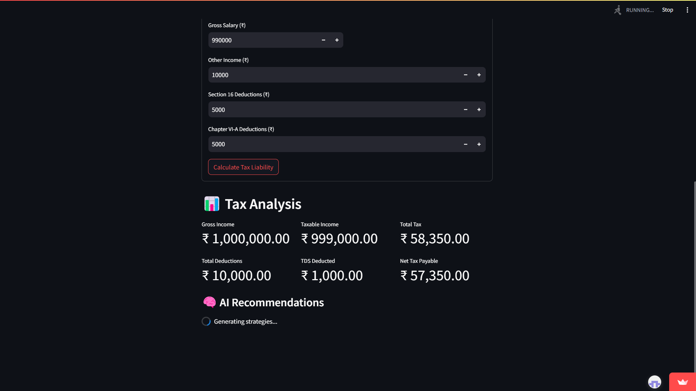

# TaxEase.Ai

TaxEase.Ai is an AI-powered tax management and filing solution designed to simplify the tax process for individuals and businesses. Leveraging advanced machine learning algorithms, TaxEase.Ai delivers intelligent tax calculations, personalized recommendations, and automated filing processes to optimize your tax experience.

## Overview

TaxEase.Ai streamlines tax management by:
- **Automating Tax Calculations:** Leverages AI to compute taxes accurately based on income, deductions, and credits.
- **Providing Intelligent Insights:** Uses predictive analytics to identify tax-saving opportunities and potential audit risks.
- **Simplifying Filing Processes:** Automates documentation, filing, and payment procedures for a seamless user experience.
- **Ensuring Data Security:** Implements robust security measures to protect sensitive financial data.

## How Does TaxEase Work?

It's quite easy actually! TaxEase simplifies the tax filing process into three simple steps:

### ✅ Register with TaxEase  
Sign up effortlessly using your **PAN card** for a secure and hassle-free experience.  
Our encrypted platform ensures your financial data stays protected while granting you seamless access to tax filing features.

### ✅ Chat with Taxify.AI  
Get **real-time, AI-powered tax guidance** tailored to your financial situation.  
Maximize your deductions, receive tax-saving tips, and clarify tax-related queries before filing—all with the help of **Taxify.AI**, your intelligent tax assistant.

### ✅ File & Pay with Ease  
Submit your tax return **securely and accurately** with just a few clicks.  
Our system auto-verifies details, minimizes errors, and ensures **compliance with Indian tax regulations**, making tax filing stress-free and efficient.


## Features

- **AI-Powered Tax Recommendations**
  - Uses machine learning models to analyze financial data.
  - Provides personalized recommendations for maximizing tax deductions.

- **PAN Card Authentication**
  - The PAN Card Authentication feature streamlines the registration process while ensuring robust security and compliance. 
  - By leveraging a government-issued identifier, this feature significantly reduces fraud and simplifies user onboarding.


- **Multi-Platform Access**
  - Automatically syncs your tax data in real time across all devices.
  - Provides a responsive interface that adapts to various screen sizes and resolutions.


- **Quick & Easy Filing**
  - The system processes user-provided financial data (such as income, expenses, and deductions) and automatically computes tax liabilities, eligible deductions, and potential refunds.


- **Maximize your refund, Minimize Tax liability**
  - Provides you with an estimated refund amount that reflects maximum possible savings.
  - It automatically identifies all eligible tax deductions and credits based on the latest tax regulations.
   

## Tech Stack

- **Backend:**
  - [Node.js](https://nodejs.org/) with Express.js for RESTful API development.
  - **AI Modules:** Python (using libraries such as TensorFlow, PyTorch, or scikit-learn) for implementing machine learning models.
- **Frontend:**
  - [React](https://reactjs.org/) (or Angular/Vue) for a responsive and dynamic user interface.
  - CSS frameworks like [Bootstrap](https://getbootstrap.com/) or [Tailwind CSS](https://tailwindcss.com/) for styling.
- **Database:**
  - PostgreSQL or MongoDB for robust data storage.
- **DevOps & Deployment:**
  - Docker for containerized deployment.
  - CI/CD pipelines (GitHub Actions, Jenkins, etc.) for automated testing and deployment.
- **Additional Tools:**
  - OCR Integration for document processing.
  - JWT for authentication and secure data access.


## Installation and Setup

### Prerequisites

- [Node.js](https://nodejs.org/) and npm/yarn installed
- [Python](https://www.python.org/) for AI module dependencies
- A compatible database (PostgreSQL or MongoDB)
- [Docker](https://www.docker.com/) (optional, for containerized deployment)

### Steps

1. **Clone the Repository:**
   ```bash
   git clone https://github.com/KeerthiSaiPG/TaxEase.Ai.git
   cd TaxEase.Ai

